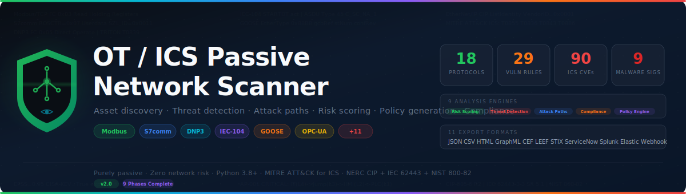

<p align="center">
  
</p>

<p align="center">
  <strong>Purely passive, offline security scanners for Operational Technology &amp; Industrial Control Systems</strong><br>
  <sub>Asset discovery · Vulnerability detection · Purdue zone mapping · Compliance assessment · Threat detection · Attack path analysis · SIEM integration</sub>
</p>

<p align="center">
  <a href="#unified-ot-scanner-v20"></a>
  <a href="#supported-protocols"></a>
  <a href="#vulnerability-detection"></a>
  <a href="#ics-cve-database"></a>
  <a href="#threat-detection--mitre-attck"></a>
  <a href="#compliance-assessment"></a>
  <a href="#integration-ecosystem"></a>
  <a href="LICENSE"></a>
</p>

---

## Overview

A collection of **purely passive** OT/ICS security scanners that analyse captured network traffic (PCAP / PCAPNG) to discover industrial devices, detect vulnerabilities, map network topology to the Purdue model, and assess compliance against ICS security frameworks. **No packets are ever sent to the network** -- all analysis is offline, making these tools safe for use in live production environments where active scanning can trip protection relays or disrupt SCADA control loops.

The project includes a **unified scanner** (v2.0) that merges and extends two earlier single-purpose scanners, adding 9 advanced analysis modules: deep asset profiling, ICS project file parsing, firewall policy generation, composite risk scoring, ICS malware threat detection, multi-platform SIEM integration, secure access auditing, configuration snapshot management, and attack path analysis.

## Scanners

| Scanner | Directory | Version | Lines | Description |
|---------|-----------|---------|------:|-------------|
| **Unified OT Scanner** | [`ot_scanner/`](ot_scanner/) | 2.0.0 | ~22,700 | Full-featured scanner: 16 protocols, 34 vuln rules, 76 CVEs, 7 malware sigs, 9 analysis engines, 11 export formats |
| **PLC Passive Scanner** | [`plc_passive_scanner/`](plc_passive_scanner/) | 1.0 | ~1,500 | Device identification scanner for PLCs (7 protocols, vendor fingerprinting) |
| **RTU Passive Scanner** | [`rtu_passive_scanner/`](rtu_passive_scanner/) | 1.0 | ~2,500 | Vulnerability scanner for RTUs/IEDs (21 vuln rules, GOOSE/MMS) |

---

## Unified OT Scanner v2.0

### Quick Start

```bash
cd ot_scanner
pip install -r requirements.txt
python ot_scanner.py capture.pcap -o reports/ -f all
```

### Supported Protocols

**13 IP-layer protocols + 3 Layer-2 protocols**, plus detection of 36+ IT/enterprise protocols for convergence risk assessment.

| Protocol | Transport | Port / EtherType | Vendor Coverage |
|----------|-----------|------------------|-----------------|
| Modbus/TCP | TCP | 502 | Multi-vendor (Schneider, Rockwell, ABB, Siemens, ...) |
| Siemens S7comm / S7comm+ | TCP | 102 | Siemens-exclusive (S7-300/400/1200/1500) |
| EtherNet/IP / CIP | TCP / UDP | 44818 / 2222 | Rockwell, Omron, Schneider, Siemens |
| DNP3 | TCP / UDP | 20000 | ABB, GE, Honeywell, Schneider, SEL |
| Omron FINS | UDP | 9600 | Omron-exclusive |
| MELSEC MC Protocol | TCP | 5006-5008 | Mitsubishi-exclusive |
| IEC 60870-5-104 | TCP | 2404 | ABB, Siemens, Schneider, GE |
| IEC 61850 MMS | TCP | 102 | ABB, Siemens, GE, Schneider |
| SEL Fast Message | TCP | 702 | SEL-exclusive |
| OPC-UA | TCP | 4840 / 4843 | Cross-vendor (IEC 62541) |
| BACnet/IP | UDP | 47808 | Building automation |
| MQTT | TCP | 1883 / 8883 | IIoT messaging |
| PROFINET RT | UDP | 34962-34964 | Siemens, multi-vendor |
| IEC 61850 GOOSE | Ethernet | 0x88B8 | Protection signalling (L2) |
| IEC 61850 SV | Ethernet | 0x88BA | Sampled Values / merging units (L2) |
| PROFINET DCP | Ethernet | 0x8892 | Device discovery (L2) |

**IT protocol detection** (36+ protocols): HTTP/S, SSH, Telnet, RDP, VNC, TeamViewer, AnyDesk, Radmin, X11, IKE/IPsec, OpenVPN, PPTP, SMB, FTP, TFTP, DNS, DHCP, NTP, SNMP, Syslog, MSSQL, MySQL, PostgreSQL, Oracle, Redis, SMTP, POP3, IMAP, AMQP, and more.

### Deep Asset Profiling

Enhanced device identification beyond basic protocol detection:

- **S7comm SZL parsing** -- Structured block extraction from SZL ID 0x0011 (Module Identification) and 0x001C (Component Identification) for order numbers, firmware versions, serial numbers, CPU families, and I/O module inventories
- **DNP3 Group 0 attributes** -- Device description (var 241), product model (var 242), firmware version (var 243), hardware version (var 244), vendor name (var 245)
- **Asset criticality inference** -- Auto-classifies devices as safety_system, process_control, monitoring, or support based on CIP Safety types, GOOSE trip keywords, safety vendor names, protocol write/control ratios, and device role
- **Communication profiles** -- Per-device master/slave/peer classification with control ratios, read/write ratios, byte volumes, and peer counts

### ICS Project File Analysis

Offline asset discovery from engineering project files (no network traffic required):

| Format | Extension | Vendor | Parser |
|--------|-----------|--------|--------|
| TIA Portal | .zap16 / .ap16 | Siemens | ZIP + XML extraction |
| Studio 5000 | .L5X | Rockwell / Allen-Bradley | XML export parsing |
| EcoStruxure | .XEF | Schneider Electric | XML export parsing |
| Generic CSV | .csv | Any CMDB | Header-row auto-mapping |
| Generic JSON | .json | Any CMDB | Array/object auto-mapping |

Project file devices receive `vendor_confidence = "ground_truth"` and bypass fingerprinting. Use `--project-dir DIR` to load.

### Vulnerability Detection

**34 behavioral vulnerability rules** across 4 protocol-specific check modules, plus 5 zone violation rules and 5 IT/OT convergence rules.

| Category | Rules | Vuln ID Prefix | Examples |
|----------|------:|----------------|----------|
| DNP3 Security | 7 | `RTU-DNP3-*` | No Secure Authentication, unauthenticated control, Direct Operate bypass, restart commands, file transfer, multiple masters, UDP transport |
| IEC 60870-5-104 Security | 5 | `RTU-104-*` | No TLS, multiple masters, unauthenticated commands, clock sync abuse, general interrogation flooding |
| IEC 61850 Security | 6 | `RTU-61850-*` | GOOSE without IEC 62351-6, simulation flag abuse, low TTL, confRev drift, MMS without TLS |
| General / Cross-Protocol | 12 | `OT-GEN-*`, `OT-OPCUA-*`, `OT-MQTT-*` | Cleartext protocols, OPC-UA without security, MQTT without TLS/auth |
| IT/OT Convergence | 5 | `OT-ITOT-*` | Remote access in OT (RDP/VNC), databases in control zone, Telnet, SMB |

### ICS CVE Database

**76 curated CVEs** across 11 vendor groups with **EPSS scores**, **CISA KEV flags**, and **exploit maturity** ratings. Each matched CVE receives a **Now / Next / Never priority** classification.

| Vendor | CVEs | Key Products |
|--------|-----:|-------------|
| Siemens | 15 | S7-1200, S7-1500, SIPROTEC, SICAM |
| Rockwell Automation | 10 | ControlLogix, CompactLogix, MicroLogix |
| Schneider Electric | 10 | Modicon M340/M580, EcoStruxure, SCADAPack |
| ABB | 8 | RTU560, RTU500, REF615, REL670 |
| GE / GE Grid Solutions | 6 | D20MX, UR-series, Mark VIe |
| SEL (Schweitzer) | 5 | SEL-3505, SEL-651R, SEL-421 |
| Omron | 5 | CJ-series, NJ-series, CP-series |
| Mitsubishi Electric | 5 | MELSEC iQ-R, GX Works |
| Honeywell | 4 | RTU2020, Experion PKS |
| Yokogawa | 3 | CENTUM VP, ProSafe-RS |
| Cross-vendor / Protocol | 5 | DNP3 SA bypass, Modbus/TCP, OPC-UA |

### Enhanced Risk Scoring

Composite risk scoring (0-100) combining multiple intelligence sources:

| Component | Weight | Source |
|-----------|--------|--------|
| Base score | Vuln severity + CVE CVSS/10 | Vulnerability + CVE engines |
| Criticality multiplier | 1.5x safety, 1.3x process_control | Asset criticality inference |
| Exposure multiplier | 1.5x L0, 1.3x L1, 1.1x L2 | Purdue zone assignment |
| CISA KEV boost | +0.3 per KEV CVE | CVE database |
| EPSS boost | +max_epss x 0.4 | CVE database |
| Protocol penalties | +5 unauth DNP3, +5 GOOSE, etc. | Vulnerability findings |
| Compensating controls | -0.05 to -0.10 per mitigation | Protocol analysis |

### Threat Detection & MITRE ATT&CK

**7 ICS malware behavioral signatures** matched against observed traffic patterns:

| Malware | Year | Target | MITRE Technique |
|---------|------|--------|----------------|
| **Industroyer/CrashOverride** | 2016 | IEC-104 breaker control | T0855, T0831 |
| **TRITON/TRISIS** | 2017 | Safety instrumented systems | T0839, T0836 |
| **Havex** | 2014 | OPC-UA reconnaissance | T0846 |
| **BlackEnergy** | 2015 | Multi-protocol + IT lateral | T0869, T0859 |
| **Pipedream/Incontroller** | 2022 | S7comm + Modbus multi-vector | T0836, T0855 |
| **Stuxnet** | 2010 | S7comm program injection | T0843, T0845 |
| **FrostyGoop** | 2024 | Modbus register manipulation | T0855 |

**4 detection modules**: unauthorized command detection, malware signature matching, reconnaissance detection, behavioral baseline anomalies. **14 MITRE ATT&CK for ICS techniques** mapped.

### Attack Path Analysis

Multi-hop attack path discovery from IT entry points to crown jewel OT devices:

- **Crown jewel identification** -- safety systems, critical PLCs/RTUs, historians, KEV-exploitable devices
- **Entry point identification** -- remote access sessions, jump servers, gateways, IT/OT bridging devices
- **BFS pathfinding** -- multi-hop with 6-hop limit, bidirectional reachability graph
- **Path scoring (0-100)** -- hop count, auth gaps, encryption gaps, Purdue span, target value, CVE exploitability
- **MITRE ATT&CK kill chain** -- per-hop technique mapping (T0886, T0859, T0855, T0836, T0839, T0843)
- **Remediation generation** -- ordered mitigation steps per path (segmentation, auth, encryption, patching)

### Secure Access Audit

Remote access detection and NERC CIP-005-6 R2 compliance:

- **Protocol detection**: RDP, SSH, VNC, TeamViewer, AnyDesk, Radmin, X11, IKE/IPsec, OpenVPN, PPTP
- **Jump server identification**: Automatic from traffic pattern (inbound remote + outbound OT)
- **Compliance classification**: Each session rated compliant / non-compliant / review_required
- **5 compliance rules**: encrypted transport, VPN DMZ termination, no direct L0-1 access, no safety system access, jump server required

### Configuration Snapshot Engine

Persistent device configuration tracking and drift detection:

- **Snapshot capture**: firmware, modules, function code profiles, program state, protocols, peers, risk
- **Persistent storage**: JSON files in `--snapshot-dir` with index metadata
- **Baseline management**: `--set-baseline` marks scan as "last known good" (LKG)
- **7 drift detection rules**: firmware_change, module_change, program_event, function_code_shift, new_protocol, peer_change, risk_escalation
- **MITRE ATT&CK mapping**: T0839, T0843, T0836, T0855, T0869, T0886

### Network Policy Engine

Auto-generate firewall segmentation rules from observed traffic patterns:

| Export Format | Target Platform | File Type |
|---------------|----------------|-----------|
| Palo Alto PAN-OS XML | Panorama / PAN-OS API | XML |
| Fortinet FortiGate CLI | FortiGate console | .conf |
| Cisco IOS Extended ACL | IOS routers/switches | .acl (per zone) |
| Generic JSON | Custom integrations | JSON |

**6 rule generation strategies**: safety system isolation (P10-49), control traffic (P50-99), flow-based allows (P100-499), DMZ enforcement (P500-599), zone segmentation (P600-799), implicit deny (P9999). Each rule maps to IEC 62443-3-3, NERC CIP-005/007, and NIST 800-82.

### Network Topology (Purdue Model)

Automatic Purdue model zone classification:

1. **Subnet inference** -- groups devices into /24 zones
2. **Purdue level assignment** -- Level 0 (Process) through Level 5 (Internet/Cloud)
3. **Criticality overrides** -- safety systems forced to L0, process control to L1
4. **Edge aggregation** -- directed graph with control/cross-zone annotations
5. **Zone violation detection** -- 5 rules enforcing IEC 62443-3-3 SR 5.1 and NERC CIP-005
6. **GraphML export** -- Gephi/yEd/Cytoscape with Purdue-level colour coding

### Compliance Assessment

**35 controls** across 3 frameworks:

| Framework | Controls | Coverage |
|-----------|----------|----------|
| NERC CIP (v5-7) | 15 | CIP-002 through CIP-013 |
| IEC 62443-3-3 | 12 | SR 1.1 through SR 7.7 |
| NIST SP 800-82 Rev 3 | 8 | Sections 5.1 through 6.3.4 |

### Integration Ecosystem

**11 export formats** for SIEM, CMDB, threat intelligence, and notification platforms:

| Format | Flag | Target Platform |
|--------|------|-----------------|
| JSON | `--json FILE` | Machine-readable full detail |
| CSV | `--csv FILE` | Spreadsheet / data analysis |
| HTML | `--html FILE` | Interactive browser report (Catppuccin Mocha) |
| GraphML | `--graphml FILE` | Gephi / yEd / Cytoscape topology |
| CEF | `--cef FILE` | Splunk, ArcSight, Elastic SIEM |
| LEEF | `--leef FILE` | IBM QRadar |
| STIX 2.1 | `--stix FILE` | ISACs, TAXII feeds |
| ServiceNow CMDB | `--servicenow FILE` | ServiceNow Import Set API |
| Splunk HEC | `--splunk-hec FILE` | Splunk HTTP Event Collector |
| Elastic ECS | `--elastic-ecs FILE` | Elasticsearch / Kibana / Filebeat |
| Webhook | `--webhook FILE` | Slack, Teams, PagerDuty, any HTTP |

Plus: `--compliance FILE` (NERC CIP + IEC 62443 + NIST 800-82), `--delta FILE` (baseline comparison), `--policy DIR` (firewall rules), `--snapshot-dir DIR` (config snapshots).

### CLI Reference

```bash
# Full scan with all outputs
python ot_scanner.py capture.pcap -o reports/ -f all

# With project file enrichment
python ot_scanner.py capture.pcap --project-dir /path/to/tia_projects/ -o reports/

# Generate firewall policies
python ot_scanner.py capture.pcap --policy policies/

# Configuration snapshot with baseline
python ot_scanner.py capture.pcap --snapshot-dir snapshots/ --set-baseline

# SIEM integration
python ot_scanner.py capture.pcap --splunk-hec events.ndjson --elastic-ecs ecs.ndjson

# ServiceNow CMDB export
python ot_scanner.py capture.pcap --servicenow cmdb_import.json

# Webhook notification
python ot_scanner.py capture.pcap --webhook alert_payload.json

# Delta analysis against baseline
python ot_scanner.py capture.pcap --delta baseline.json --json current.json

# Compliance audit
python ot_scanner.py capture.pcap --compliance audit.txt

# Verbose, filter high+ severity
python ot_scanner.py capture.pcap -v --severity high
```

**Exit codes:** `1` if CRITICAL or HIGH findings detected (CI/CD pipeline gating), `0` otherwise.

### Architecture

```
ot_scanner/
├── ot_scanner.py                   CLI entry point + argument parsing
├── requirements.txt                scapy, dpkt, colorama
└── scanner/
    ├── core.py                     Unified PCAP analysis engine
    ├── models.py                   20+ data types (dataclasses)
    ├── protocols/                  16 industrial protocol analyzers
    │   ├── modbus.py, s7comm.py, enip.py, dnp3.py, fins.py, melsec.py
    │   ├── iec104.py, iec61850_mms.py, sel_protocol.py
    │   ├── opcua.py, bacnet.py, mqtt.py, profinet.py, goose.py
    │   ├── it_detect.py            IT protocol detector (36+ protocols)
    │   └── behavior.py             Deep packet inspection statistics
    ├── fingerprint/                7-step vendor fingerprinting pipeline
    ├── vuln/                       34 vulnerability rules (4 check modules)
    ├── topology/                   Purdue zones, violations, GraphML
    ├── cvedb/                      76 ICS CVEs with EPSS + CISA KEV
    ├── risk/                       Composite risk scoring (0-100)
    ├── threat/                     7 ICS malware sigs + anomaly baselines
    ├── attack/                     Multi-hop attack path analysis
    ├── access/                     Secure access audit (CIP-005 R2)
    ├── config/                     Configuration snapshots + drift detection
    ├── policy/                     Firewall rule generation (4 formats)
    ├── project_files/              ICS project file parsers (5 formats)
    ├── export/                     CEF, LEEF, STIX, ServiceNow, Splunk, Elastic, Webhook
    ├── compliance/                 35 controls (NERC CIP + IEC 62443 + NIST)
    ├── delta/                      Baseline diff analysis
    └── report/                     JSON, CSV, HTML, GraphML reports
```

---

## Legacy Scanners

The unified OT scanner (v2.0) supersedes both legacy scanners. They remain in the repository for reference.

### PLC Passive Scanner

Device-identification-focused scanner for industrial PLCs (7 protocols). Outputs device inventory with vendor, model, firmware, and risk scoring.

### RTU Passive Scanner

Vulnerability-detection-focused scanner for RTUs, FRTUs, and IEDs (9 protocols, 21 vulnerability checks, Layer-2 GOOSE/SV).

---

## Why Passive Scanning?

Active network scanners are **dangerous in OT environments**: unexpected packets can crash PLCs, trip protection relays, disrupt real-time control loops, and break single-master SCADA sessions. Passive scanning from a PCAP eliminates all of these risks.

Captures can be collected via network TAPs, port mirroring (SPAN), dedicated sensors, or existing IDS/NDR appliances.

---

## Requirements

- Python **3.8+**
- **scapy >= 2.5.0** (recommended) or **dpkt >= 1.9.8** (fallback)
- Optional: **colorama >= 0.4.6** (coloured terminal output)

```bash
pip install scapy dpkt colorama
```

---

## License

MIT -- see [LICENSE](LICENSE) for details.
