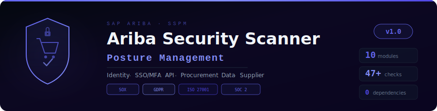

<p align="center">
  
</p>

<p align="center">
  <strong>A Python-based SaaS Security Posture Management (SSPM) scanner for SAP Ariba</strong>
</p>

<p align="center">
  
  
  
  
  
</p>

---

## Overview

**SAP Ariba SSPM Security Scanner** performs offline security posture assessment of SAP Ariba procurement environments. Modeled after commercial SaaS Security Posture Management (SSPM) tools (AppOmni, Obsidian, Adaptive Shield, Nudge Security), it evaluates configuration exports for misconfigurations, access risks, compliance gaps, and security drift.

- **SSPM-aligned** — identity security, configuration management, data protection, compliance
- **47+ security checks** across 10 audit modules
- **Offline analysis** — reads JSON/CSV configuration exports, no live API access required
- **Zero dependencies** — Python 3.8+ stdlib only
- **Compliance mapped** — SOX, GDPR, ISO 27001, SOC 2

---

## SSPM Audit Modules (10)

| # | Module | Key | Checks | Focus |
|---|--------|-----|--------|-------|
| 1 | 🔑 **Identity & Access** | `iam` | 8 | Dormant accounts, admin sprawl, SoD conflicts, privilege creep, terminated access, shared accounts, orphaned users |
| 2 | 🔒 **Authentication & SSO** | `auth` | 6 | SAML SSO enforcement, MFA coverage, password policy, session timeout, IP restrictions, certificate expiry |
| 3 | 🔌 **API & Integration** | `api` | 5 | OAuth scope sprawl, deprecated grant types, stale API clients, webhook security, integration auth, rate limiting |
| 4 | 📋 **Procurement Controls** | `procurement` | 6 | Approval workflows, auto-approve thresholds, contract controls, catalog governance, payment 3-way match, maverick spend |
| 5 | 🛡️ **Data Protection** | `data` | 6 | External data sharing, field-level encryption, retention policies, PII field classification, export controls, supplier data isolation |
| 6 | 🏭 **Supplier Management** | `supplier` | 4 | Onboarding controls, supplier MFA, bank detail verification, continuous risk monitoring |
| 7 | 📊 **Audit & Compliance** | `audit` | 5 | Audit logging, event type coverage, log retention, SIEM integration, compliance framework mapping |
| 8 | 🌐 **Network Security** | `network` | 3 | Ariba Network profile privacy, TLS version, document auto-sharing |
| 9 | 🔔 **Notification & Alerting** | `notification` | 2 | Security alert rules, notification channels |
| 10 | ⚠️ **Configuration Drift** | `drift` | 2 | Critical security settings baseline, configuration drift detection |

---

## Quick Start

```bash
git clone https://github.com/Krishcalin/SAP-Ariba-Security-Scanner.git
cd SAP-Ariba-Security-Scanner

# Generate sample data with deliberate security issues
python generate_sample_data.py

# Run the scanner
python ariba_scanner.py --data-dir ./sample_data --output report.html

# Scan specific modules
python ariba_scanner.py --data-dir ./exports --modules iam auth procurement

# Filter severity
python ariba_scanner.py --data-dir ./exports --severity HIGH

# Drift detection against a baseline
python ariba_scanner.py --data-dir ./exports --config baseline.json
```

---

## Data Export Guide

Export the following from your SAP Ariba tenant (via Ariba Administrator or API):

| File | Source | Description |
|------|--------|-------------|
| `users.csv` | User Management | All users with login dates, status, department |
| `user_groups.csv` | Group Management | User-to-group assignments |
| `sso_config.json` | SAML SSO settings | SSO provider, assertions, enforcement |
| `mfa_config.json` | MFA configuration | MFA methods, bypass, enforcement |
| `password_policy.json` | Password settings | Complexity, lockout, history |
| `api_clients.json` | API/OAuth clients | Client IDs, scopes, grant types |
| `api_permissions.csv` | API access matrix | Client-to-entity permissions |
| `integration_config.json` | Integration setup | Connectors, webhooks, auth |
| `approval_workflows.json` | Approval flow rules | Thresholds, auto-approve |
| `procurement_policies.json` | Procurement policies | Spend limits, controls |
| `supplier_config.json` | Supplier management | Onboarding, verification |
| `data_sharing.json` | Sharing settings | External sharing rules |
| `audit_config.json` | Audit log config | Event types, retention, SIEM |
| `encryption_config.json` | Certificates & TLS | Cert expiry, field encryption |
| `ip_restrictions.json` | IP allowlists | Access restrictions |
| `contract_config.json` | Contract settings | Approval, expiry alerts |
| `payment_config.json` | Payment controls | 3-way match, duplicate check |
| `custom_fields.csv` | Custom field list | PII classification |
| `notification_config.json` | Alert rules | Security event notifications |

---

## SSPM Security Categories

### 🔑 Identity Security (IAM-001 through IAM-008)
Detects dormant accounts (configurable threshold, default 90 days), excessive administrator group membership, orphaned users without group assignments, terminated employees retaining active access, Segregation of Duties (SoD) conflicts across the procurement lifecycle (Req Creator/Approver, PO Creator/Approver, Invoice/Payment, Supplier/Contract), shared/generic accounts, and privilege creep.

### 🔒 Authentication Posture (AUTH-001 through AUTH-008)
Validates SAML 2.0 SSO configuration (signed assertions, encrypted assertions, IDP-initiated risk, SSO enforcement), MFA enforcement (admin-specific MFA, SMS deprecation, bypass controls), password policy strength (length, complexity, history, lockout), session timeout limits, IP-based access restrictions, and X.509 certificate lifecycle.

### 🔌 API & Integration Risk (API-001 through API-007)
Identifies overly broad OAuth scopes (wildcard, admin, full access), deprecated grant types (password, implicit), stale API clients unused for 180+ days, sensitive entity write permissions, unauthenticated integrations, HTTP webhooks without HMAC verification, and missing rate limiting.

### 📋 Procurement Controls (PROC-001 through PROC-007)
Evaluates approval workflow completeness, auto-approve threshold values ($25K+ flagged), contract management controls (expiry alerts, dual approval, competitive bidding), catalog change governance, payment controls (three-way match, duplicate detection, auto-payment approval), and maverick/off-catalog spend policies.

### 🛡️ Data Protection (DATA-001 through DATA-006)
Assesses external data sharing scope (ALL/PUBLIC flagged), field-level encryption for sensitive data, data retention/purge policies, custom field PII classification (auto-detects SSN, Tax ID, Bank Account, etc. in field names), bulk export restrictions, and supplier portal data isolation.

### 🏭 Supplier Security (SUPP-001 through SUPP-004)
Reviews supplier onboarding workflows (approval, due diligence, risk assessment, self-registration), supplier portal authentication (MFA), bank detail change verification (BEC/invoice fraud prevention), and continuous supplier risk monitoring.

---

## Project Structure

```
SAP-Ariba-Security-Scanner/
├── ariba_scanner.py                # Main entry point
├── generate_sample_data.py         # Sample data generator
├── modules/
│   ├── base.py                     # Data loader & base auditor
│   ├── identity_access.py          # Identity & Access Management
│   ├── core_modules.py             # Auth, API, Procurement, Data
│   ├── extended_modules.py         # Supplier, Audit, Network, Alerts, Drift
│   └── report_generator.py         # HTML dashboard report
├── sample_data/                    # 23 demo config files
├── docs/
│   └── banner.svg
├── .gitignore
├── LICENSE
├── CONTRIBUTING.md
└── README.md
```

---

## References

- [SAP Ariba Security Guide](https://help.sap.com/docs/ariba)
- [SAP Ariba Cloud Security Assessment (CSA)](https://www.sap.com/about/trust-center/certification-compliance/sap-ariba-csa-pack.html)
- [SAP Ariba SOC 2 Audit Report](https://www.sap.com/about/trust-center/certification-compliance.html)
- [SSPM — AppOmni](https://appomni.com/learn/saas-security-fundamentals/sspm/)
- [SSPM — Obsidian Security](https://www.obsidiansecurity.com/sspm-saas-security-posture-management)
- [CIS Controls v8](https://www.cisecurity.org/controls)
- [NIST SP 800-53 Rev 5](https://csrc.nist.gov/publications/detail/sp/800-53/rev-5/final)
- [SOX IT Controls — Procurement](https://www.sarbanes-oxley-101.com/)

## Disclaimer

This tool is for **authorized security assessments only**. It performs offline configuration analysis and does not connect to any live SAP Ariba tenant.

## License

MIT License — see [LICENSE](LICENSE).
